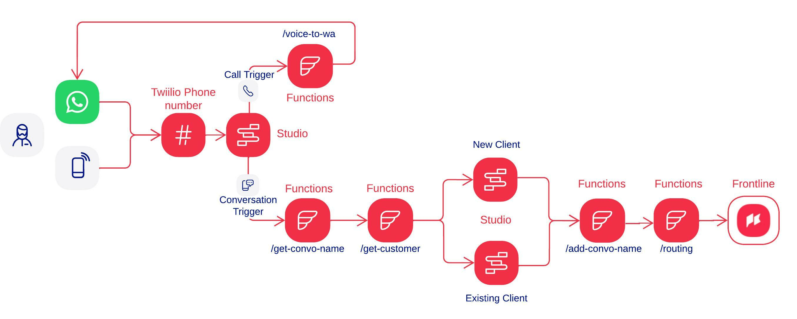

# Frontline Airtable + Studio for WhatsApp and Voice Calls

## Foreword

This repository is built on top of the project [Frontline Airtable Serverless Quickstart](https://github.com/twilio-labs/frontline-airtable-serverless-quickstart). To make it easier, I copied their instructions here on this repo and made a few changes to include the features I added.

## Overview

This is a solution for Twilio Frontline that integrates Twilio Serverless Functions with Airtable as the contact database, and adds a few other functions to assit on building a powerful bot with Twilio Studio for WhatsApp messages and Voice calls. It implements a few features:

- 📇 Display a contact list in Frontline from a list of Airtable Contacts
- 🔀 Route inbound conversations in Frontline based on Airtable record ownership
- 📓 Define message templates in Airtable
- 🔐 Okta SSO setup script for easy SSO integration
- 💻 Functions to make the message bot better
- 💻 A function to make an automated voice call bot to redirect to WhatsApp

> **Note**: Airtable's API has a maximum throughput of 5 requests per second. This product is not suitable for large teams, see the Integration Limits section for more details.

## Prerequisites

We recommend following the setup outlined Frontline node.js quickstart, which shows you how to do the following:

- A Twilio Account. Don't have one? [Sign up](https://www.twilio.com/try-twilio) for free!
- Twilio's Command-Line Interface (CLI). [Install it here](https://www.twilio.com/docs/twilio-cli/quickstart).
- A WhatsApp enabled [phone number](https://www.twilio.com/docs/whatsapp/self-sign-up).
- A [Twilio Frontline instance](https://www.twilio.com/docs/frontline/nodejs-demo-quickstart#create-a-new-twilio-frontline-instance).
- Twilio Conversations [configured](https://www.twilio.com/docs/frontline/nodejs-demo-quickstart#configure-twilio-conversations) to use the Frontline Conversations service as it's default conversation service.
- Additionally, you'll need to [copy this Airtable Base template](https://airtable.com/shrbXF88oQlRh7ZXh) and have your [Airtable API key](https://support.airtable.com/hc/en-us/articles/219046777-How-do-I-get-my-API-key-) along with your [Base ID](https://support.airtable.com/hc/en-us/articles/4405741487383-Understanding-Airtable-IDs).

Once you reach the step to "Configure the Frontline Integration Service" you are ready to deploy this app.

## Project Setup

Follow these steps to clone the repository, install dependencies, and set environment variables:

```bash
# Clone the repository:
git clone

# Change to the project directory:
cd frontline-airtable-studio-bot

# Install dependencies:
npm install

# Copy the sample environment variables file to .env:
cp .env.example .env
```

### Environment Variables Reference

Here are the environment variables that must be configured for the app to run:

```bash
ACCOUNT_SID= # Your twilio account SID, found in the console.
AUTH_TOKEN= # Your auth token, found in the console.

SSO_REALM_SID= # Go to console > Frontline > Manage > SSO/Log in

TWILIO_SMS_NUMBER= # Phone number in e164 format (e.g. +5511912345678)
TWILIO_WHATSAPP_NUMBER= # A Twilio WhatsApp sender (e.g. whatsapp:+5511912345678).

AIRTABLE_API_KEY= # Your Airtable API key
AIRTABLE_BASE_ID= # Your Airtable Base ID
```

## Deploy

Deploy this Serverless app with one command:

```bash
twilio serverless:deploy --service-name=frontline-airtable-studio-bot
```

> :information_source: **Always deploy to the same Twilio Account as your Frontline Service**: This integration service uses Twilio-signed requests to protect the callback URLs. The callback URLs will reject requests from a different Twilio account with a 403 error. You can check which account you're deploying to with `twilio profiles:list` and add another account with `twilio profiles:add`.

The app provides the following callback URLs:

- `/callbacks/add-convo-name`: called inside the Twilio Studio flow to add a name to the conversation. Conversations are created by default without a name, so we'll need a name to differentiate between a new conversation (start the studio flow bot) or an already existing one (ignores the studio flow bot).
- `/callbacks/crm`: called when Frontline loads the contact list or a user detail page.
- `/callbacks/get-convo-name`: called inside the Twilio Studio flow to get the name of the existing conversation (if there is one). **We use the conversation name to check if there is already an opened conversation with the customer, so the bot won't start again**.
- `/callbacks/get-customer`: called inside the Twilio Studio flow to get the customer name on Airtable that is making the contact (if there is a record).
- `/callbacks/outgoing-conversation`: called when a user initiates an outbound conversation.
- `/callbacks/routing`: called when a messages is sent inbound that does not match an open conversation.
- `/callbacks/templates`: called when a user opens the templates menu.
- `/callbacks/voice-to-wa`: called inside the Twilio Studio flow in the incoming call trigger. It will transfer the call to a whatsapp conversation and end the call.

## Configure Callbacks

Copy and paste the callback URLs (uncluding your unique subdomain) into your Frontline configuration in the console.

### Routing configuration

In the Twilio Console, go to **_Frontline > Manage > Routing_** and select the option **Do not route**.

### Frontline callbacks

In the Twilio Console, go to **_Frontline > Manage > Callbacks_** and copy / paste the following callback URLs from your Frontline integration service:

- CRM Callback URL: `[your_app_url]/callbacks/crm`
- Outgoing Conversations Callback URL: `[your_app_url]/callbacks/outgoing-conversation`
- Templates Callback URL: `[your_app_url]/callbacks/templates`


## Data Format & Integration Limits

[Click here to learn more about this in the Frontline Airtable Serverless Quickstart project](https://github.com/twilio-labs/frontline-airtable-serverless-quickstart#data-format).

## Twilio Studio

If you are not familiar with it, [learn more about Twilio Studio here](https://www.twilio.com/docs/studio/user-guide/get-started).

### Studio Diagram



### Studio Instructions

- In your Twilio console, go to **_Studio > Flows_** and create a new flow.
- To give you a head start, select the option **Import from JSON** and paste the content found in the [studio-flow.json](studio-flow.json) file.
- You can use this flow to get you started. You can change the texts, languages, flows accordingly once created (pay attention to the architecture in the diagram above to change the flow without issues).
- Don't forget to change the function URLs inside the widgets to the ones you deployed above.

## Conversations Address Configuration

Finally, we need to [create a Conversation Address Configuration](https://www.twilio.com/docs/conversations/api/address-configuration-resource#create-an-addressconfiguration-resource) and setup the webhook which will be called with the `onMessageAdded` event, that redirects the message to our bot on Twilio Studio.

In your terminal, run the following:

```bash
twilio api:conversations:v1:configuration:addresses:create \
    --friendly-name "Frontline Bot" \
    --auto-creation.enabled  \
    --auto-creation.type studio \
    --auto-creation.studio-flow-sid FWXXXXXXXXXXXXXXXXXXXXXX \ # The flow SID you created above
    --auto-creation.webhook-filters onMessageAdded \
    --type whatsapp \
    --address <Your WhatsApp Twilio Number> # e.g. whatsapp:+5511912345678
```

## Kudos

Special thanks to [Charlie Weems](https://github.com/cweems), [Dan Jeannotte](https://github.com/danjea) and [shzoghby](https://github.com/shzoghby) for building the original project.
